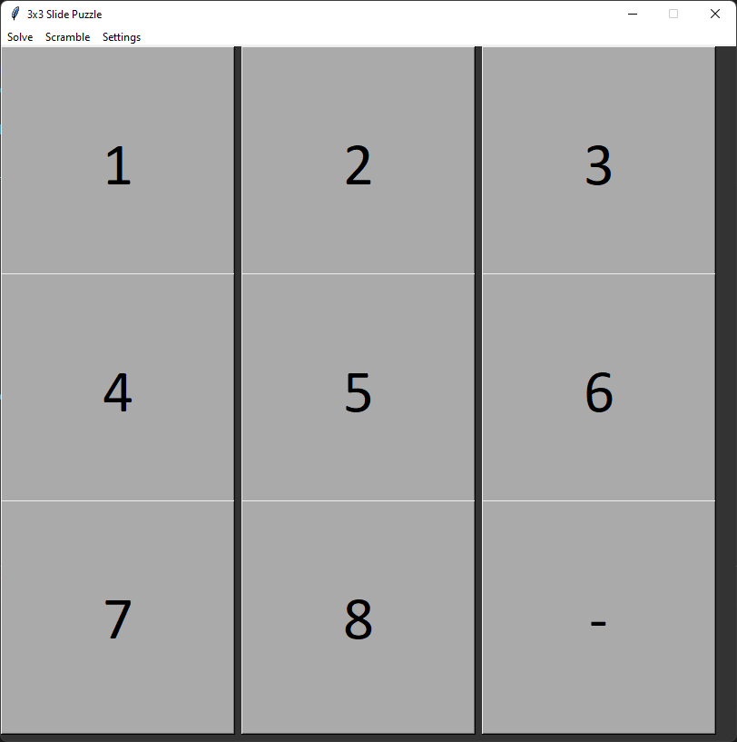

# 8 Puzzle Search

This is a simple implementation of the 8 puzzle search problem using the A* algorithm and best-first search. If run as a script, it will open a Tkinter window and allow you to play the game. If imported as a module, it will provide fucntions to solve the puzzle.

<!-- Image from images/gui.png -->

Clicking on a square adjacent to the "-" square will swap the tile clicked on with the "-", just like a physical 8 Puzzle.
